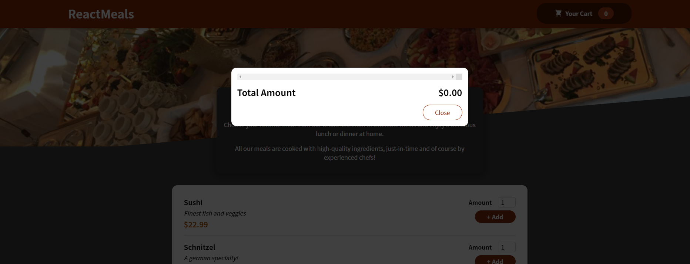
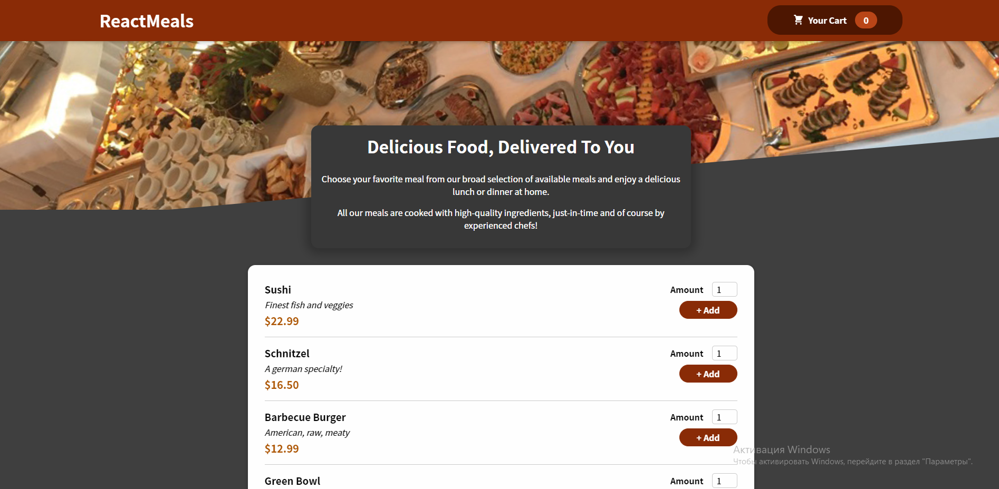
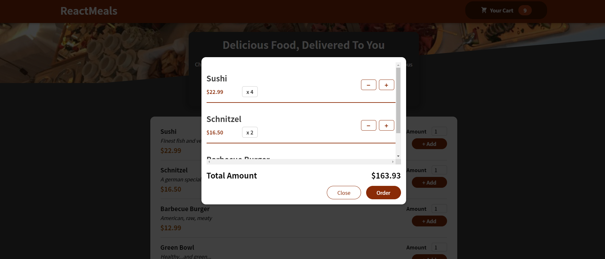

# Приложение интернет магазина еды для заказов с англоязычного курса https://www.udemy.com/course/react-the-complete-guide-incl-redux/ 

## Цель проекта: практика написания просто приложения с использованием базовых фич библиотеки React, таких как: хуков useState, useEffect, useReducer; создания и использования контекста с помощью хука useContext. 

## Технологии: React, React hooks, React context

## Что я научился: 
1) Правильной структуре React компонентов
2) Делать модельные окна и использовать их с помощью React portals
3) Использовать React context для контроля за состоянием приложения

## https://alexandrsyvorotkin.github.io/Food-order-application/

